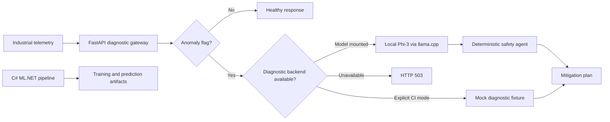
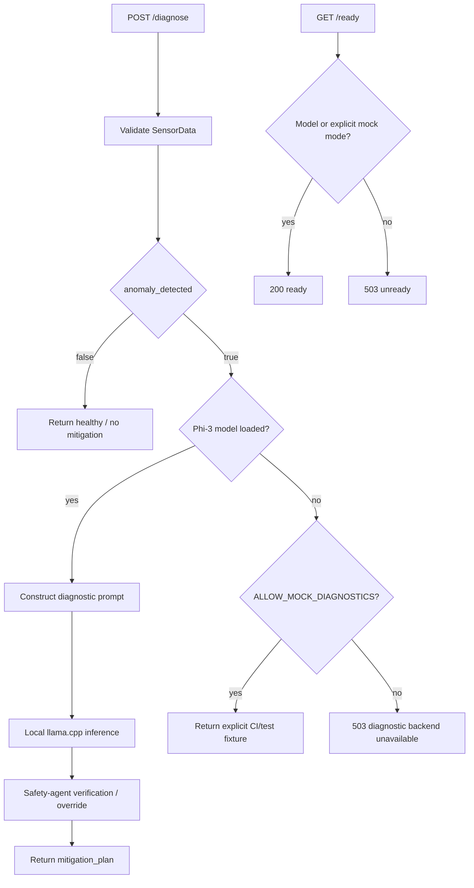

# PredictiveMaintenance IoT — Edge Diagnostic AI

[](https://github.com/CoreyLeath-code/PredictiveMaintenance_IoT/actions/workflows/ci.yml)
[](https://github.com/CoreyLeath-code/PredictiveMaintenance_IoT/actions/workflows/benchmarks.yml)
[](https://github.com/CoreyLeath-code/PredictiveMaintenance_IoT/actions/workflows/container-scan.yml)
[](https://github.com/CoreyLeath-code/PredictiveMaintenance_IoT/actions/workflows/docker-publish.yml)
[](https://github.com/CoreyLeath-code/PredictiveMaintenance_IoT/releases)
[](LICENSE)

PredictiveMaintenance IoT is a portfolio-scale predictive-maintenance repository with two related engineering surfaces: a C#/ML.NET data-and-model pipeline and a Python FastAPI diagnostic gateway that can optionally invoke a local quantized Phi-3 model through `llama-cpp-python`.

> **Evidence boundary:** the verified Python CI path exercises API behavior, explicit mock diagnostics, safety routing, static checks, and benchmark plumbing. It does not establish real Phi-3 latency, field-level failure-detection quality, plant safety certification, or production capacity.

## Engineering scope

Implemented:

- C# modules for ingestion, feature engineering, model training, and prediction.
- FastAPI `/diagnose`, `/health`, and `/ready` endpoints.
- Explicit fail-closed behavior when the diagnostic model is unavailable.
- Opt-in `ALLOW_MOCK_DIAGNOSTICS=true` mode for local/CI tests only.
- Local Phi-3 GGUF inference through `llama-cpp-python` when the model artifact exists.
- Deterministic safety-agent post-processing of generated mitigation text.
- Python tests and performance tests, container scanning, IaC/security workflows, and GHCR publication automation.
- A non-root release container that expects model weights as an external artifact rather than downloading a mutable multi-GB file while the image is built.

Not claimed:

- Safety certification or autonomous machine-control authority.
- A validated plant dataset, calibrated failure probabilities, or representative F1/recall evidence.
- Real Phi-3 TTFT/tokens-per-second from the CI benchmark path.
- Production SLOs, multi-tenant isolation, or internet-facing deployment readiness.

## Architecture



The current Python serving path does not call the C# ML.NET modules directly. They are separate repository components and should be treated as such until an explicit integration boundary is implemented and tested.

## System design flow



## Quickstart — verified CI/local path

```bash
python -m venv .venv
. .venv/bin/activate
python -m pip install --upgrade pip
python -m pip install -r requirements.txt

ALLOW_MOCK_DIAGNOSTICS=true pytest -q tests/
ALLOW_MOCK_DIAGNOSTICS=true pytest -q tests/performance/
```

Start the API without a model artifact in explicit test mode:

```bash
ALLOW_MOCK_DIAGNOSTICS=true \
uvicorn src.api.main:app --host 0.0.0.0 --port 8000
```

Check the runtime:

```bash
curl --fail http://127.0.0.1:8000/health
curl --fail http://127.0.0.1:8000/ready
```

Example diagnostic request:

```bash
curl -X POST http://127.0.0.1:8000/diagnose \
  -H 'content-type: application/json' \
  -d '{"sensor_id":104,"temperature":92.5,"vibration":4.82,"anomaly_detected":true}'
```

## Full local-model mode

The application looks for:

```text
./models/phi-3-mini-4k-instruct-q4.gguf
```

Provide a reviewed model artifact at that path before startup. The release container intentionally does **not** download model weights during `docker build`; mount the artifact instead:

```bash
docker build -t predictive-maintenance-iot:local .
docker run --rm -p 8000:8000 \
  -v "$PWD/models:/app/models:ro" \
  predictive-maintenance-iot:local
```

For a production-like experiment, record the exact model source, immutable revision, file SHA-256, `llama-cpp-python` version, CPU/GPU details, thread count, prompt/decoding settings, and dataset/workload provenance.

## Reproducibility and benchmark contract

The committed performance test at `tests/performance/test_llm_benchmark.py` deliberately forces `llm=None` and enables `ALLOW_MOCK_DIAGNOSTICS`. Therefore it measures the FastAPI/test-fixture path rather than real Phi-3 generation. Mock-path latency must not be presented as LLM TTFT or tokens-per-second evidence.

Reproduce the current benchmark path:

```bash
ALLOW_MOCK_DIAGNOSTICS=true pytest tests/performance/test_llm_benchmark.py -v
```

For any published performance number, record:

| Evidence | Required provenance |
|---|---|
| API latency | commit SHA, runner/hardware, warm-up, sample count, concurrency, p50/p95/p99 |
| Model inference | exact GGUF SHA-256, model revision, llama.cpp version, threads/device, decoding config |
| Failure detection | dataset/version, split strategy, leakage controls, class balance, precision/recall/F1 |
| Safety behavior | scenario corpus, expected overrides, false-negative analysis, domain review |
| Container | image digest, base image, vulnerability scan, model-artifact relationship |

## Release and package contract

The repository already has GitHub Releases. The missing package path was caused by the container publication workflow using `${{ github.repository }}` directly as the GHCR image name; this repository name contains uppercase characters, while Docker/GHCR repository names must be lowercase.

The hardened workflow publishes to:

```text
ghcr.io/coreyleath-code/predictivemaintenance-iot:vX.Y.Z
ghcr.io/coreyleath-code/predictivemaintenance-iot:latest
```

It supports both semantic tag pushes and manual recovery for an existing tag. A release tag is checked out before the image is built so the package corresponds to that immutable source state.

## L6 engineering assessment

Strong foundations include explicit fail-closed behavior, separate liveness/readiness semantics, opt-in mock mode, local-model execution, deterministic safety post-processing, and broad CI/security automation.

Highest-value next steps:

1. Pin and verify the exact GGUF artifact instead of referring to a mutable upstream `main` path.
2. Separate runtime, test, and heavyweight LLM dependency manifests and pin release dependencies.
3. Add a versioned representative evaluation dataset and publish real detection metrics from that artifact.
4. Add a real-model benchmark job on disclosed hardware; keep it separate from mock API regression tests.
5. Integrate the C# predictor and Python diagnostic gateway through an explicit versioned contract if they are intended to form one runtime system.
6. Add authentication, rate limits, request-size bounds, audit logging/redaction, and deployment threat modeling before external exposure.
7. Capture GHCR image digest, SBOM, model SHA-256, and signing/provenance evidence together in each release.

See [L6_AUDIT.md](L6_AUDIT.md) for the detailed audit.

## Reviewer Q&A

**Why does `/ready` return 503 when the model is absent?**  
Process liveness is not the same as diagnostic readiness. The service can be alive while its required diagnostic backend is unavailable.

**Does the performance test benchmark Phi-3?**  
No. It explicitly replaces the model with `None` and enables the mock diagnostic path. It is useful API regression evidence, not LLM inference evidence.

**Why externalize the GGUF from the Docker image?**  
A model artifact is large, independently versioned, and should be verified by digest. Baking a download from a mutable URL into every container build weakens reproducibility and makes GHCR publishing unnecessarily expensive and fragile.

**Is the generated mitigation plan allowed to control machinery?**  
No such authority is established by this repository. The text path should remain advisory until a safety case, validated scenario corpus, operational controls, and domain review exist.

**Why is there both C# and Python?**  
The repository contains ML.NET predictive-maintenance components and a Python edge diagnostic API. Today they are separate implementation surfaces; the README intentionally does not imply an integration that the runtime does not demonstrate.

## Repository map

```text
src/DataIngest.cs                 C# ingestion
src/FeatureEngineer.cs            C# feature engineering
src/ModelTrainer.cs               C# ML.NET training
src/Predictor.cs                  C# prediction
src/api/main.py                   FastAPI diagnostic gateway
src/agents/                       deterministic agent logic
tests/                            Python/C# tests
tests/performance/                mock-path performance regression tests
Dockerfile                        non-root Python diagnostic image
.github/workflows/docker-publish.yml
                                  GHCR publication/signing
```

## License

MIT. See [LICENSE](LICENSE).
